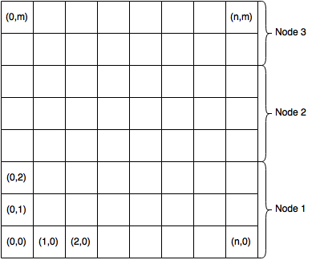
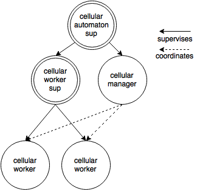
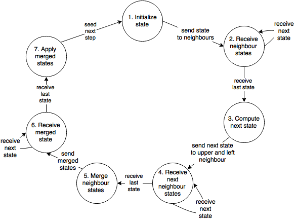
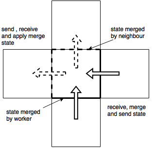

# cellular_automaton

Generic cellular automaton developed during Artificial Intelligence course at
AGH university of Science and Technology, Cracow 2015.

## Board structure

Cellular automaton board consists of tiles. Each tile neighbor with four
other tiles and is associated with one cellular worker. Tiles on the edge 
of the board are connected with each other, so that we achieve imitation 
of a infinite board. Moreover, board is divided into vertical sections, where
each section is placed on different node.

## Supervision tree

Cellular automaton consist of following components:
* cellular_automaton_sup
* cellular_worker_sup
* cellular_manager
* cellular_worker

Dependencies between those components are presented below.

## Algorithm

Each cellular worker runs according to following algorithm:

## Merging states

When it comes to merging states between cellular workers, each worker is responsible
for resolving conflicts between him an his bottom and right neighbour.

